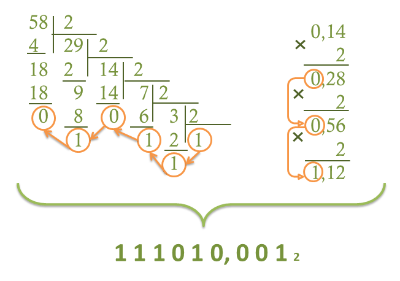
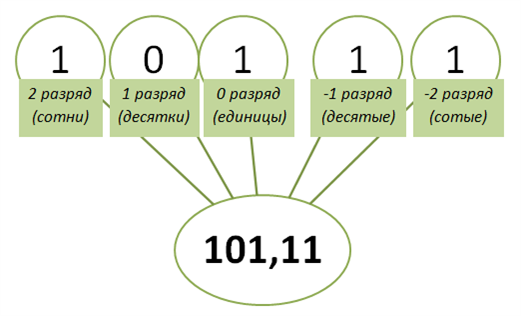
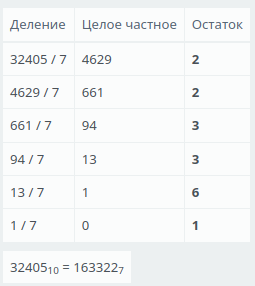

## 1. Как перевести дробные числа из 10-ой в любую другую систему счисления?
1. Целую часть числа переводим по алгоритму перевода целых чисел из десятичной системы счисления в любую другую систему счисления. Делим число на основание системы счисления, в которую необходимо перевести, при этом записывая в обратном порядке остатки, из которых складывается искомое число.
2. Дробную часть числа умножаем последовательно на основание системы счисления, в которую необходимо перевести. Умножаем до тех пор, пока не получим единицу в целой части или пока не получим нужное число разрядов по условию задания. Из целых частей получившихся произведений записываем в прямом порядке искомое число.

Пример:
**перевести число 58,14 из десятичной системы счисления в двоичную систему счисления.**

Следуя алгоритму, переводим сначала целую часть десятичного числа 58 в двоичную систему счисления. Делим его последовательно на основание искомой системы счисления - 2. Получаем число 111010. Следующим шагом переводим дробную часть 0,14 от десятичного числа, отбросив целую часть. Умножаем последовательно число на основание искомой системы счисления - 2. Умножаем до тех пор, пока не получим единицу в целой части. Записываем выделенные на схеме числа в прямом порядке и получаем в итоге двоичное число 111010,001.

## 2. Как перевести дробные числа из в 10-ую систему счисления?
1. Целую часть числа переводим по алгоритму перевода целых чисел из любой системы счисления в десятичную систему счисления. Умножаем каждую цифру в числе на основание системы счисления, возведённое в степень, соответствующую разряду цифры в числе, а затем все суммируем. 
2. Дробную часть переводим по тому же алгоритму, но с учётом того, что возводим основание системы в отрицательные степени.

Пример:
**перевести число $\pmb{101,11_2}$ в десятичную систему счисления.**

Сначала рассмотрим число и определим разряды каждой цифры в числе, чтобы понимать в какую степень
ставить основание системы счисления.

Так как основание исходной системы счисления - **2**, то получаем следующее решение.
$$ \begin{align}
&101,11_2 = \\
& = 1\cdot2^2+0\cdot2^1+1\cdot2^0+1\cdot2^{-1}+1\cdot2^{-2} = \\
& =4+0+1+0,5 +0,25 = 5,75
\end{align} $$
В итоге получаем, что число $101,11_2$ в двоичной системе счисления равно числу $5,75_{10}$ в десятичной системе
счисления.
## 3. Что такое мощность алфавита?
количество символов в алфавите, которое вычисляется по формуле $N = 2^i$ , где i — информационный вес символа.
## 4. Приведите общую форму представления числа в позиционной системе счисления.
иди нахуй с такими вопросами
## 5. Что понимают под весом цифры в числе?
тот вклад, который она вносит в значение числа

**В непозиционных системах счисления** вес цифры (т. е. тот вклад, который она вносит в значение числа) **не зависит от ее позиции** в записи числа. Так, в римской системе счисления в числе ХХХII (тридцать два) вес цифры Х в любой позиции равен просто десяти.

**В позиционных системах счисления** вес каждой цифры изменяется в зависимости от ее положения (позиции) в последовательности цифр, изображающих число. Например, в числе 757.7 первая семерка означает 7 сотен, вторая — 7 единиц, а третья — 7 десятых долей единицы.
## 6. В чем отличие цифры от числа?
**число – это количество, а цифра – знак для обозначения количества**. Например, с помощью тех же цифр можем записать разные числа: 37, 73. Чтобы записать на письме число 705, надо использовать три цифры – 7, 0 и 5. Также можно сказать, что как слова состоят из букв, так и числа состоят из цифр.
## 7. Чему равно основание системы счисления, выраженное с помощью алфавита этой же системы счисления?
тому, что тот, кто так написал - долбоеб

ну или 10: в десятичной системе счисления мы имеем 10 цифр, самая большая - 9, и когда мы увеличиваем число на 1, оно превращается в 10 - то есть самая правая цифра обнуляется, а цифра слева увеличивается на 1 (9 это то же самое, что 09, а 0+1=1). Обычно, когда мы пишем основание системы счисления, мы показываем количество цифр, которое в ней есть, в десятичной системе счисления; но ведь это тоже количество, выраженное числом, и его тоже можно писать не только в десятичной системе, но и в любой другой. 

Возьмем восьмиричную систему счисления: в ней мы имеем 8 цифр, самая большая - 7, увеличиваем число 7 на 1, получается 10. Чтобы написать какое-либо число в ней и не перепутать его с десятичной системой, мы напишем маленькую цифру 8 в конце, например $123_8$, - в этой записи мы видим четыре цифры: 1, 2, 3 и 8. Из них три в восьмиричной системе, а 8 в десятичной, потому что это основание системы счисления, и чтобы не путаться, все адекватные люди всегда пишут это основание в десятичной системе. А запутаться здесь можно в том, что если мы эту восьмерку переведем в восьмиричную систему, в которой у нас находится само число, то она превратится в 10 (в начале абзаца объяснил почему в 10) - и такое будет происходить с любой системой счисления, где основание меньше 10. Вот смотри, я придумаю три числа в разных системах счисления, при этом основания запишу в той же системе, что и само число: $100101_{10},\ 32179_{10},\ 24213_{10}$ - и вот скажи мне, где здесь какая система счисления? Первое число ведь может быть записано и в двоичной системе счисления, и в пятиричной, и в десятичной, и в шестнадцатиричной, и в какой угодно еще - оно не нарушит правил ни одной из систем.

не знаю нахуя я накатал такую телегу, но надеюсь понятно почему ответом на вопрос я считаю 10 и почему не стоит так писать, как предлагает вопрос

*может пойти преподом в рта...*
## 8. В какой с/сч число 2354 имеет минимальное количество десятков? (2-ой, 8-ой, 10-01, 16-ой)? Максимальное?
$2354_{10} = 100100110010_2 = 4462_8 = 932_{16}$  
насколько я понимаю, десятки - это вторая справа цифра, следовательно минимальное это 1 в двоичной, а максимальное - 6 в восьмиричной
## 9. Переведите число 32405 в 7-ую систему счисления (письменно).

