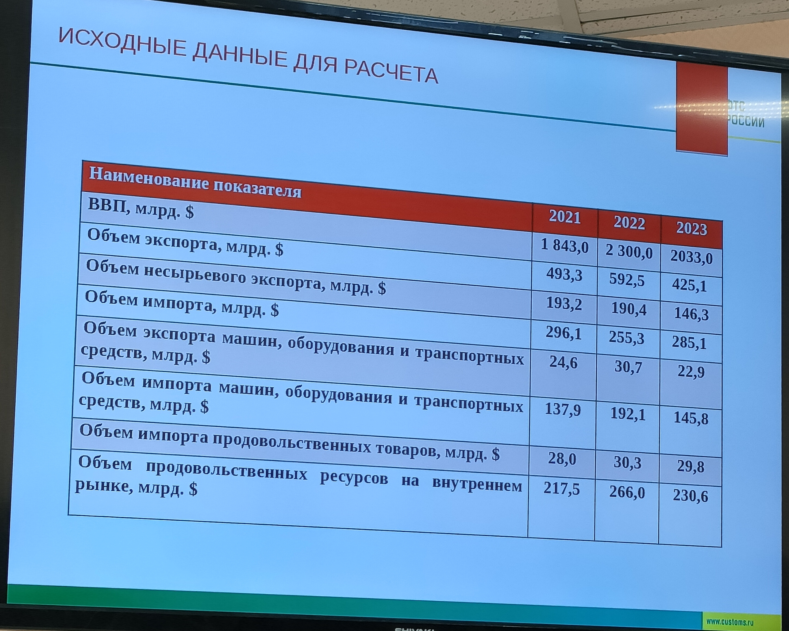

#### экономическая безопасность
в конце общий вывод 

##### 1. экспортная квота
$$
экспортная\ доля\ (квота) = \frac{объем\ экспорта}{ввп} \times 100\%
$$

пз (пороговое значение) - нет

2021: 26.77%   
2022: 25.76%   
2023: 20.91%

**объёмы экспортной доли снижаются ->**
1. страна меньше участвует в международном разделении труда
2. у нас не совсем хорошая модель экспорта, тк мы вывозим сырье, а хотелось бы готовую продукцию
3. после санкций произошла переориентация на рынки Азии и Африки, но их недостаточно, с Европой торговли было больше/их рынок больше
4. бьём рекорды по экспорту зерна и муки
##### 2. импортная квота
вывод нужно писать к каждому из способов, "словарный запас вам в помощь"
###### 1 способ
$$\frac{импорт}{ввп} \times 100\%$$

порог: 35%, если больше - плохо для национальной экономики

2021: 16.07%  
2022: 11.1%  
2023: 14.02%

что-то про открытость

конкуренция

###### 2 способ
более реальные цифры, тк учитывает внутреннее потребление

$$\begin{align}
\frac{внутреннее\ потребление}{ВВП}\times100\% \\
внутреннее\ потребление=ВВП - экспорт + импорт
\end{align}$$

порог: 35%

2021: 89.3%  
2022: 85.34%  
2023: 93.11%

итог больше порога -> страна зависит от импорта
либо как вариант, настолько много производства и экспорта, что не хватает ресурсов

##### 3. открытость экономики (внешнеторговая квота)
$$\frac{экспорт+импорт}{ВВП}\times100\%$$
порог: 25-35% (единственный порог, который включает в себя интервал)

2021: 42.83%  
2022: 36.86%  
2023: 34.93%

- если меньше 25 -> протекционизм, нет конкуренции, снижение качества продукции, монополизм, нет роста и развития, недостаточно технологий и ресурсов
- больше 35 -> фритредерство, все наоборот, может произойти рост цен
- 25-35 -> смотреть куда ближе и как меняется, 
- если не меняется - стабильность

экспорт больше в Африку, импорт из Азии 

##### 4. сальдо внешнеторгового баланса (в % к ввп)
$$\frac{экспорт-импорт}{ВВП}\times 100\%$$
порог: 8%

что-то успели блять (записать наверно)
##### 5. индекс физического объема экспорта
$$\frac{\text{экспорт в текущем периоде}}{\text{экспорт в предыдущем периоде}}\times100\%$$ (есть ещё вариант в знаменатель экспорт в базовом периоде)
порог: 110%

2021: невозможно посчитать тк нет данных за 2020  
2022:   
2023: 
##### 6. индекс физического объема импорта
все то же самое только импорт
$$\frac{\text{импорт в текущем периоде}}{\text{импорт в предыдущем периоде}}\times100\%$$
порог: 108%
##### 7. Доля машин, оборудования и транспортных средств в общем объеме импорта
$$\frac{\text{импорт машин, оборудования и транспортных средств}}{\text{весь импорт}}\times100\%$$
порог: снижение в динамике
##### 8. Доля машин, оборудования и транспортных средств в общем объеме несырьевого экспорта
$$\frac{\text{экспорт машин, оборудования и транспортных средств}}{\text{несырьевой экспорт}}\times100\%$$
порог: рост в динамике
##### 9. Доля импортного продовольствия во всех продовольственных ресурсах
$$\frac{\text{импорт продовольствия}}{\text{объем всех прод товаров на внутр рынке}}\times100\%$$
порог: 25%
